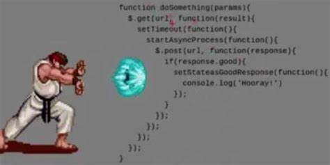
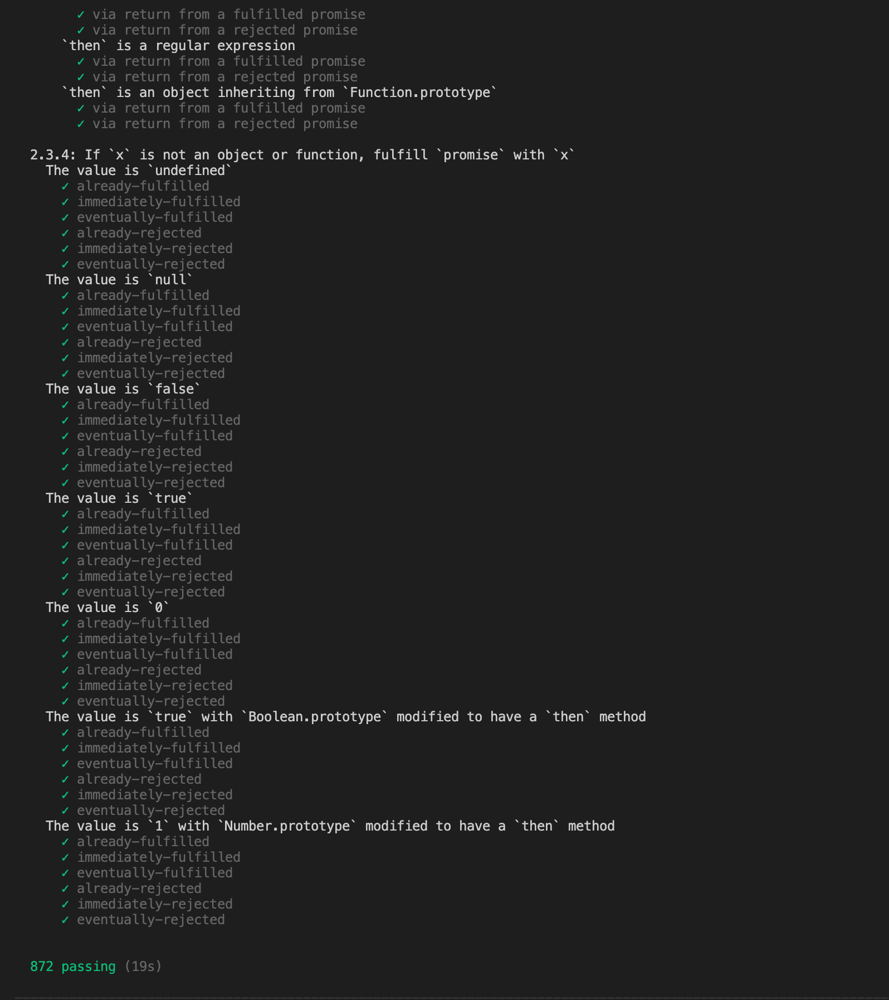

::: tip 本文引用文档地址
- [ PromiseA+ 规范文档](https://promisesaplus.com/)
- [ Promise到底解决了什么问题？](https://juejin.im/post/6844903636737196045)
:::


## Promise 到底解决了什么问题？

大家都知道 **Promise** 解决了回调地狱的问题，但是到底什么是回调地狱? 他到底哪儿**have some  wrong** ？
是因为嵌套回调还是，还是回调执行顺序问题，还是不够美观？

<div align="center">
   
</div>


### 回调地狱

来脑补一下，实现一个说话的需求，说完才能说下一句，那么很容易的写出下面这样的一段代码

```javascript
function say (word, callback) {
  console.log(word)
  setTimeout(() => {
    callback&&callback()
  },1000)
}
```

ok! fine!! 那么现在要说话了

```javascript
say("first", function () {
  say("second", function () {
    say("third", function () {
      console.log("end");
    });
  });
});
// first second third  end
```

在这个例子中的嵌套的问题仅仅是缩进的问题，而缩进除了会让代码变宽可能会造成读代码的一点不方便之外，并没有什么其他的问题。如果仅仅是这样，为什么不叫“缩进地狱”或“嵌套地狱”？

把回调地狱完全理解成缩进的问题是常见的对回调地狱的误解。要回到“回调地狱”这个词语上面来，它的重点就在于“回调”，而“回调”在JS中应用最多的场景当然就是异步编程了。

所以，“回调地狱”所说的嵌套其实是指异步的嵌套。它带来了两个问题：**可读性的问题和信任问题**


#### **可读性问题**

很容易找到一个这样执行顺序问题的问题

```javascript
for (var i = 0; i < 5; i++) {
  setTimeout(function() {
    console.log(new Date, i);
  }, 1000);
}

console.log(new Date, i);
```

很好，结果不那么重要，但是你总得想那么一会吧。想代码的执行顺序问题，那么你必须熟知异步代码的执行机制，还要能很快的分析出想要的结果，

so 你能做到么。

#### **信任问题**

好的，让我们接着脑补一下，你是华夏某银行的少主，你的一个程序员写下了一段代码，调用了三方的ajax 扣款请求，但是由于三方库机制问题，调用了多次。

那么，你能很好的信任回调么。还会不会有其他的信任问题发生呢。

so 

- 回调时机不对（早/晚）
- 多次执行回调
- 成功失败同时执行

...

实际问题在于控制权转交给了第三方，不可控的执行导致了我们最头疼的信任问题，实际在开发中，我们需要检查的状态更多，依赖更多。信任问题带来的成本，就大大导致了可读性降低，需要更多的代码来check。

虽然这些 fail 出现的概率并不高，可能在你编码的时候都没有关注到，但是实际上却需要很多臃肿的代码去强壮他，这就不够友好了。

实际上万能的开发者们也想了很多方法来解决信任问题

- for example
```javascript
// 增加失败回调
function sendAjax(onSuccess,onFail) {
  if(success) {
    onSuccess&&onSuccess()
  }else{
    onFail&&onFail()
  }
}
```
- example again
```javascript
// node error first
fs.stat(file, (err, stat) => {
  if (err) {
    doSomeThing()
  } else {
    doOtherThing()
  }
})
```

实际上这并没有解决所有的问题，诸如回调多次执行，复杂场景下的回调问题。


::: tip 小总结
异步回调带来的问题主要集中在 **可读性差**/**信任问题**
::: 


## Promise 如何解决这些问题

### 介绍


首先我们来看一下 **PromiseA+** 规范的第一句话

**An open standard for sound, interoperable JavaScript promises—by implementers, for implementers.**

一个开放的标准，用于实施者对实施者的声音，可互操作的JavaScript保证。

::: details 查看更多

A promise represents the eventual result of an asynchronous operation. The primary way of interacting with a promise is through its then method, which registers callbacks to receive either a promise’s eventual value or the reason why the promise cannot be fulfilled.

一个promise表示异步操作的最终结果。 与诺言互动的主要方式是通过then方法，该方法注册回调以接收诺言的最终值或诺言无法实现的原因。

This specification details the behavior of the then method, providing an interoperable base which all Promises/A+ conformant promise implementations can be depended on to provide. As such, the specification should be considered very stable. Although the Promises/A+ organization may occasionally revise this specification with minor backward-compatible changes to address newly-discovered corner cases, we will integrate large or backward-incompatible changes only after careful consideration, discussion, and testing.

该规范详细说明了then方法的行为，提供了一个可互操作的基础，所有Promises / A +符合诺言的实现都可以依靠该基础来提供。 因此，该规范应被视为非常稳定。 尽管Promises / A +组织有时会通过向后兼容的微小更改来修订此规范，以解决新发现的极端情况，但只有经过仔细考虑，讨论和测试之后，我们才会集成大型或向后不兼容的更改。
:::

### `1.0` Terminology 概念术语

- `promise` is an object or function with a then method whose behavior conforms to this specification.
- `thenable` is an object or function that defines a then method.
- `value` is any legal JavaScript value (including undefined, a thenable, or a promise).
- `exception` is a value that is thrown using the throw statement.
- `reason` is a value that indicates why a promise was rejected.


### `2.0` Requirements 要求 （实现）

对于创建一个可互操作的**javascript**保证的标准来说，要解决的问题无非就是状态管理，注册回调事件，和可靠的承诺解决体系

**PromiseA+**规范实际上就从这三点出发，定义了三种标准。

那么我们来开始写我们的代码，基于`es6 class`

```javascript
class Promise {
  constructor(executor) {
    // PromiseA+...
  }
}
module.exports = Promise;
```

#### `2.1`Promise States
A promise must be in one of three states: pending, fulfilled, or rejected.

一个`Promise` 必须处于`pending``fulfilled``rejected`三种状态之间

  - `2.1.1`When pending, a promise:
    - `2.1.1.1`may transition to either the fulfilled or rejected state.
  - `2.1.2`When fulfilled, a promise:
    - `2.1.2.1`must not transition to any other state.
    - `2.1.2.2`must have a value, which must not change.
  - `2.1.3`When rejected, a promise:
    - `2.1.3.1`must not transition to any other state.
    - `2.1.3.2`must have a reason, which must not change.
  Here, “must not change” means immutable identity (i.e. ===), but does not imply deep immutability.

  这里实际上定义了`Promise` 的状态转换关系，定义了
  
  - 初始`pending`状态，可以转换为其他两个状态
  - 处于成功失败状态不能够转换到其他状态，必须有对应的成功值value or 失败原因reason
  - 失败状态原因引用不可更改


so！！！ do it
```javascript
class Promise {
  constructor(executor) {
    // 定义初始化状态常量
    this.PENDING = 'pending';//初始态
    this.FULFILLED = 'fulfilled';//初始态
    this.REJECTED = 'rejected';//初始态


    // PromiseA+ 2.1.1.1
    // 初始化状态
    this.status = this.PENDING;

    // PromiseA+ 2.1
    // 定义缓存通过then注册的成功失败回调的数组，支持 then 方法注册多个回调
    this.onResolveCallbacks = [];
    this.onRejectCallbacks = [];

    // 缓存this，避免this指向问题导致bug
    const self = this;

    // 定义成功失败方法，作为Promise 传入的函数体的参数
    // 实现PromiseA+状态转换 定义成功失败参数
    function reject(v) {
      // Here, “must not change” means immutable identity (i.e. ===), but does not imply deep immutability.
      const reason = v;
      //PromiseA+ 2.1.3
      if (self.status === self.PENDING) {
        self.status = self.REJECTED;
        self.value = reason;
        self.onRejectCallbacks.forEach(item => item(self.value));
      }
    }
    function resolve(value) {
      //PromiseA+ 2.1.2
      if (self.status === self.PENDING) {
        self.status = self.FULFILLED;
        self.value = value;
        self.onResolveCallbacks.forEach(item => item(self.value));
      }
    }

    // 开始执行函数体，捕获错误。执行报错则直接拒绝Promise
    try {
      executor(resolve, reject);
    } catch (error) {
      reject(error);
    }


  }
}
module.exports = Promise;
```

:kissing

  `new Promise`过程已经实现了
#### `2.2`The then Method

A promise must provide a then method to access its current or eventual value or reason.

A promise’s then method accepts two arguments:

```javascript
promise.then(onFulfilled, onRejected)
```
那么在类上定义方法
```javascript

class Promise {
  constructor(executor) {
    ...
  }
  
  // PromiseA+ 2.2 // PromiseA+ 2.2.6
  then(onFulfilled, onRejected) {

  }
}
module.exports = Promise;
```

  - `2.2.1` Both onFulfilled and onRejected are optional arguments:
     - `2.2.1.1` If onFulfilled is not a function, it must be ignored.
     - `2.2.1.2` If onRejected is not a function, it must be ignored.


  - `2.2.2` If onFulfilled is a function:
     - `2.2.2.1` it must be called after promise is fulfilled, with promise’s value as its first argument.
     - `2.2.2.2` it must not be called before promise is fulfilled.
     - `2.2.2.3` it must not be called more than once.


  - `2.2.3` If onRejected is a function,
     - `2.2.3.1` it must be called after promise is rejected, with promise’s reason as its first argument.
     - `2.2.3.2` it must not be called before promise is rejected.
     - `2.2.3.3` it must not be called more than once.

  > - 成功/失败回调必须是一个`funciton`，不是函数将被忽略
  > - `成功/失败回调`必须在 `成功/失败` 之后被调用，第一个参数必须是`value/reason`
  > - `成功/失败回调`不能调用多次

  - `2.2.4`onFulfilled or onRejected must not be called until the execution context stack contains only platform code. [3.1].

  > `成功/失败回调` 不能在Promise 平台代码执行完之前被调用，意义在于防止调用时还有回调没有被注册进来

  - `2.2.5`onFulfilled and onRejected must be called as functions (i.e. with no this value). [3.2]
  > `成功/失败回调` 必须作为函数被调用，如果拿到的参数不是函数，忽略它，生成默认的同步执行函数，以相同的值执行后续回调

  - `2.2.6`then may be called multiple times on the same promise.
    - `2.2.6.1`If/when promise is fulfilled, all respective onFulfilled callbacks must execute in the order of their originating calls to then.
    - `2.2.6.2`If/when promise is rejected, all respective onRejected callbacks must execute in the order of their originating calls to then.


  > - `then` 方法可能被同一个`promise` 调用多次
  > - `then` 方法注册的`成功/失败回调`必须被以注册的顺序执行

  - `2.2.7`then must return a promise [3.3].
    - `2.2.7.1`If either onFulfilled or onRejected returns a value x, run the Promise Resolution Procedure [[Resolve]](promise2, x).
    - `2.2.7.2`If either onFulfilled or onRejected throws an exception e, promise2 must be rejected with e as the reason.
    - `2.2.7.3`If onFulfilled is not a function and promise1 is fulfilled, promise2 must be fulfilled with the same value as promise1.
    - `2.2.7.4`If onRejected is not a function and promise1 is rejected, promise2 must be rejected with the same reason as promise1.

  ```javascript
  promise2 = promise1.then(onFulfilled, onRejected);
  ```


  > - `then` 方法必须返回一个`Promise instance`
  > - `promise1` 成功或则失败回调正确执行拿到一个返回值`value x` 运行`Promise Resolution Procedure`解析程序`[Resolve]](promise2, x)`
  > - `promise1` 拒绝`throws an exception e` ，就以相同的原因拒绝`promise2`
  > - `promise1` 的 `成功/失败回调` 不是一个`function` 而且`promise1` 成功/失败时，`promise2`必须以相同的`value`/`e` 被成功或者拒绝 


so!!! do it!!!

`PromiseA+ 2.2.4` onFulfilled or onRejected must not be called until the execution context stack contains only platform code.

为了防止在平台代码执行完毕，完全注册回调之前调用回调，采用宏任务`setTimeout0`实现
::: details 展开查看constructor


```javascript
constructor(executor) {
  this.PENDING = 'pending';//初始态
  this.FULFILLED = 'fulfilled';//初始态
  this.REJECTED = 'rejected';//初始态
  //PromiseA+ 2.1.1.1
  this.status = this.PENDING;

  // PromiseA+ 2.1
  this.onResolveCallbacks = [];
  this.onRejectCallbacks = [];


  const self = this;
  function reject(v) {
    const reason = v;
    // PromiseA+ 2.2.4
    setTimeout(() => {
      //PromiseA+ 2.1.3
      if (self.status === self.PENDING) {
        self.status = self.REJECTED;
        self.value = reason;
        // console.dir(self);
        // console.log('------self--------------------------------');
        self.onRejectCallbacks.forEach(item => item(self.value));
      }
    });

  }
  function resolve(value) {
    // PromiseA+ 2.2.4
    setTimeout(() => {
      //PromiseA+ 2.1.2
      if (self.status === self.PENDING) {
        self.status = self.FULFILLED;
        self.value = value;
        self.onResolveCallbacks.forEach(item => item(self.value));
      }
    });
  }
  try {
    executor(resolve, reject);
  } catch (error) {
    reject(error);
  }
}
```
:::


```javascript

class Promise {
  constructor(executor) {
    ...
  }
  

  resolvePromise(promise2, x, resolve, reject) {

  }

  // PromiseA+ 2.2 // PromiseA+ 2.2.6
  then(onFulfilled, onRejected) {
    //缓存this
    const self = this;
    //PromiseA+ 2.2.1 / PromiseA+ 2.2.5 / PromiseA+ 2.2.7.3 / PromiseA+ 2.2.7.4
    onFulfilled = typeof onFulfilled === 'function' ? onFulfilled : x => x;
    onRejected = typeof onRejected === 'function' ? onRejected : e => { throw e; };

    let promise2;

    function fulfillCallback(resolve, reject) {
      // PromiseA+ 2.2.4
      setTimeout(() => {
        try {
          const x = onFulfilled(self.value);
          //PromiseA+ 2.2.7.1
          self.resolvePromise(promise2, x, resolve, reject);
        } catch (error) {
          //PromiseA+ 2.2.7.2
          reject(error);
        }
      });
    }
    function rejectCallback(resolve, reject) {
      // PromiseA+ 2.2.4
      setTimeout(() => {
        try {
          const e = onRejected(self.value);
          //PromiseA+ 2.2.7.1
          self.resolvePromise(promise2, e, resolve, reject);
        } catch (error) {
          //PromiseA+ 2.2.7.2
          reject(error);
        }
      });
    }

    // PromiseA+ 2.2.2
    if (self.status === self.FULFILLED) {
      //PromiseA+ 2.2.7
      return promise2 = new Promise((resolve, reject) => {
        fulfillCallback(resolve, reject);
      });

    }
    // PromiseA+ 2.2.3
    if (self.status === self.REJECTED) {
      //PromiseA+ 2.2.7
      return promise2 = new Promise((resolve, reject) => {
        rejectCallback(resolve, reject);
      });
    }
    if (self.status === self.PENDING) {
      //PromiseA+ 2.2.7
      return promise2 = new Promise((resolve, reject) => {
        self.onResolveCallbacks.push(() => {
          fulfillCallback(resolve, reject);
        });

        self.onRejectCallbacks.push(() => {
          rejectCallback(resolve, reject);
        });
      });
    }
  }
}
module.exports = Promise;
```


so 2.2.7.1 是个什么鬼！！鬼！！鬼啊！！！！

接着看下去吧


#### `2.3`The Promise Resolution Procedure

::: danger 交互性 javascript 保证
If either onFulfilled or onRejected returns a value x, run the Promise Resolution Procedure [[Resolve]](promise2, x).

`promise1` 成功或则失败回调正确执行拿到一个返回值`value x` 运行`Promise Resolution Procedure`解析程序`[Resolve]](promise2, x)`
:::


The promise resolution procedure is an abstract operation taking as input a promise and a value, which we denote as [[Resolve]](promise, x). If x is a thenable, it attempts to make promise adopt the state of x, under the assumption that x behaves at least somewhat like a promise. Otherwise, it fulfills promise with the value x.

This treatment of thenables allows promise implementations to interoperate, as long as they expose a Promises/A+-compliant then method. It also allows Promises/A+ implementations to “assimilate” nonconformant implementations with reasonable then methods.


> `promise resolution procedure`promise 解决程序实际上是一种承诺实现的抽象，将`promise` 和值`x` 作为输入，表示为`[[Resolve]]（promise，x)` 如果x是可能的，则在x的行为至少类似于承诺的假设下，尝试使承诺采用x的状态。 否则，它将以值x履行承诺。
> 
> 这种对可实现对象的处理使答应实现可以互操作，只要它们公开了符合Promises / A +的then方法即可。 它还允许Promises / A +实现使用合理的then方法“整合”不合格的实现。


想要运行 `promise resolution procedure`， 需要遵循瞎下面的规范。

- `2.3.1` If promise and x refer to the same object, reject promise with a TypeError as the reason.
> 如果`promise` 和`x`指向同一个对象，以一个`TypeError`作为原因拒绝`promise`

- `2.3.2` If x is a promise, adopt its state [3.4]:
  - `2.3.2.1` If x is pending, promise must remain pending until x is fulfilled or rejected.
  - `2.3.2.2` If/when x is fulfilled, fulfill promise with the same value.
  - `2.3.2.3` If/when x is rejected, reject promise with the same reason.

> 如果`x`是一个`promise`（是自己的实例`instanceof`） 采用下面的状态
> - 如果`x`在`pending`状态，`promise2`必须保持`pending`状态直到`x`被`fulfilled/rejected`
> - 如果`x` 被 `fulfilled/rejected`，`promise2` 必须保持 `x` 相同的 `value/reason` 被 `fulfilled/rejected`


- `2.3.3` Otherwise, if x is an object or function,
  - `2.3.3.1` Let then be x.then. [3.5]
  - `2.3.3.2` If retrieving the property x.then results in a thrown exception e, reject promise with e as the reason.
  - `2.3.3.3` If then is a function, call it with x as this, first argument resolvePromise, and second argument rejectPromise, where:

    - `2.3.3.3.1` If/when resolvePromise is called with a value y, run [[Resolve]](promise, y).
    - `2.3.3.3.2` If/when rejectPromise is called with a reason r, reject promise with r.
    - `2.3.3.3.3` If both resolvePromise and rejectPromise are called, or multiple calls to the same argument are made, the first call takes precedence, and any further calls are ignored.

    - `2.3.3.3.4` If calling then throws an exception e,
      - `2.3.3.3.4.1` If resolvePromise or rejectPromise have been called, ignore it.
      - `2.3.3.3.4.2` Otherwise, reject promise with e as the reason.

  - `2.3.3.4` If then is not a function, fulfill promise with x.

- `2.3.3.4` If x is not an object or function, fulfill promise with x.


> 当`x` 是一个`object` or `function` 此时可能是一个同步的处理函数，也可能是一个`thenable` 对象

> - 访问`x`的`then` 属性 实际上该操作可能会报错，一般来说访问一个对象的属性不会报错，但是如果该属性是一个 `getter` 的时候，在执行`getter` 的时候可能会抛异常`e`。此时应该以`e` 来拒绝`peomise2`

> - 当`then` 是一个`function`，通过`then.call(x)`调用它，同时给`x`注册成功处理函数和失败处理函数， 
>   - 当成功回调被执行并传入`y`的时候，运行`[[Resolve]](promise, y)` 继续解析。
>   - 当失败回调被执行并传入`e`的时候，把`e`作为`reason`拒绝`promise2` 


> - 如果成功失败回调被多次调用，那么第一次的调用将优先调用，其他的调用将被忽略，这里需要添加`called` 标志是否被调用，在每次调用成功失败时校验，并调用时立马修改标志位状态
> - 如果x不是`function` 对象那么以`x`实现`promise`
> - 如果x不是`thenable` 对象那么以`x`实现`promise`


::: tip 
解析程序实际上保证了`promise` 的可靠性，对`thenable`对象状态的判断，循环解析，直到`x`作为一个普通的不能在被解析的非`thenable`才实现调用，对错误的处理也贯彻整个流程，而且保证了调用的唯一性。
这实现了那句**可互操作的JavaScript保证。**
:::


那么，让我们来一步一步的实现它吧


```javascript
resolvePromise(promise2, x, resolve, reject) {
  const self = this;
  // PromiseA+ 2.3.1
  if (promise2 === x) { return reject(new TypeError('循环引用')); }


  // PromiseA+ 2.3.2
  if (x instanceof Promise) {
    if (x.status === self.PENDING) {
      // PromiseA+ 2.3.2.1
      x.then(function(y) { self.resolvePromise(promise2, y, resolve, reject); }, reject);
    } else {
      // PromiseA+ 2.3.2.2  /PromiseA+ 2.3.2.3
      x.then(resolve, reject);
    }
    // PromiseA+ 2.3.3
  } else if (x && ((typeof x === 'object') || (typeof x === 'function'))) {
    // PromiseA+ 2.3.3.3.3  / PromiseA+ 2.3.3.3.4.1
    let called = false;
    try {
      // PromiseA+ 2.3.3.1
      const then = x.then;
      // PromiseA+ 2.3.3.3
      if (typeof then === 'function') {
        try {
          then.call(
            x,
            function(y) {
              if (called) return;
              called = true;
              // PromiseA+ 2.3.3.3.1
              self.resolvePromise(promise2, y, resolve, reject);
            },
            function(e) {
              if (called) return;
              called = true;
              // PromiseA+ 2.3.3.3.2
              reject(e);
            }
          );
        } catch (e) {
          if (called) return;
          called = true;
          // PromiseA+ 2.3.3.3.2
          reject(e);
        }

      } else {
        // PromiseA+ 2.3.3.4
        resolve(x);
      }

    } catch (error) {
      if (called) return;
      called = true;
      // PromiseA+ 2.3.3.2 / PromiseA+ 2.3.3.4.2
      reject(error);
    }
  } else {
    // PromiseA+ 2.3.4
    resolve(x);
  }
}
```


#### Promise.all/race/resolve/reject

到此`PromiseA+`规范已经完全实现，原则上所有的`Promise` 库都应该遵循此规范，现代浏览器支持的`promise` 都支持一些`Promise.all`，`Promise.race`，`Promise.resolve`，`Promise.reject`，接下来让我们来实现它


```javascript
//all 实现
Promise.all = function(promises) {
  //promises是一个promise的数组
  return new Promise(function (resolve, reject) {
    const arr = []; //arr是最终返回值的结果
    let i = 0; // 表示成功了多少次
    function processData(index, y) {
      arr[index] = y;
      if (++i === promises.length) {
        resolve(arr);
      }
    }
    for (let i = 0; i < promises.length; i++) {
      promises[i].then(function (y) {
        processData(i, y);
      }, reject);
    }
  });
};

// race 实现
Promise.race = function (promises) {
  return new Promise(function (resolve, reject) {
    for (let i = 0; i < promises.length; i++) {
      promises[i].then(resolve, reject);
    }
  });
};

// Promise.resolve 实现
Promise.resolve = function (value) {
  return new Promise(function(resolve, reject) {
    resolve(value);
  });
};

// Promise.reject 实现
Promise.reject = function (reason) {
  return new Promise(function(resolve, reject) {
    reject(reason);
  });
};
```


## Promise 规范测试

[Promises/A+ 一致化测试套件](https://github.com/promises-aplus/promises-tests)


#### usage
```sh
npm install promises-aplus-tests -g
```

测试套件实际上是一个cli命令行工具，只需要在Promise 上暴露出一个`fucntion`接口`deferred`,函数返回一个对象，对象包含一个Promise 实例，和实例的resolve,reject 参数

Adapters
In order to test your promise library, you must expose a very minimal adapter interface. These are written as Node.js modules with a few well-known exports:

- resolved(value): creates a promise that is resolved with value.
- rejected(reason): creates a promise that is already rejected with reason.
- deferred(): creates an object consisting of { promise, resolve, reject }:
  - promise is a promise that is currently in the pending state.
  - resolve(value) resolves the promise with value.
  - reject(reason) moves the promise from the pending state to the rejected state, with rejection reason reason.


```javascript
Promise.deferred = function () {
  const defer = {};
  defer.promise = new Promise(function (resolve, reject) {
    defer.resolve = resolve;
    defer.reject = reject;
  });
  return defer;
};
```

进入到`Promise.js`所在目录，运行

```sh
promises-aplus-tests ./Promise.js
```

or in package.json

```json
"scripts": {
  "testa:promise": "promises-aplus-tests ./src/promise/Promise.js"
},
```


那么顺利的话！ 你讲看到这个

<div align="center">
   
</div>


## generator 函数
