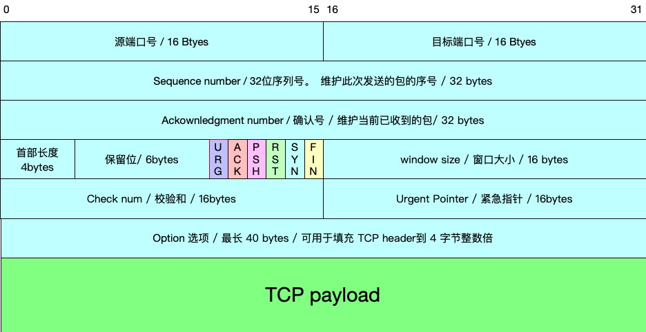
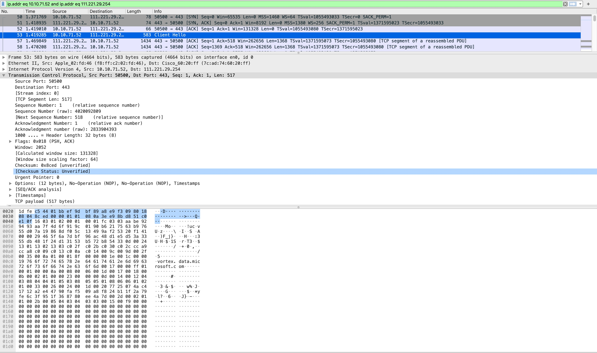
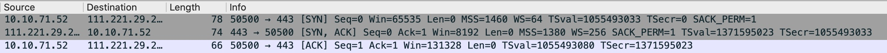
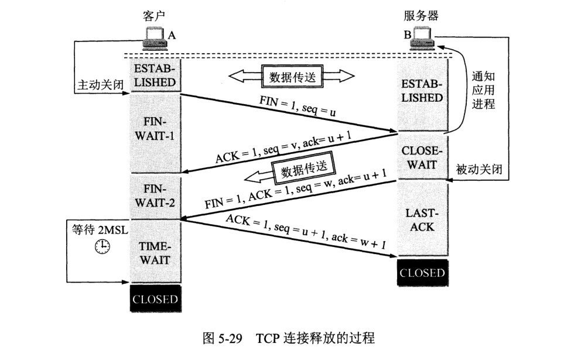

# TCP 协议 详解

## 描述

是一种面向连接的、可靠的、传输控制协议.

TCP将用户数据打包构成报文段，它发送数据时启动一个定时器，另一端收到数据进行确认，对失序的数据重新排序，丢弃重复的数据

## 为什么要有 TCP 

TCP 协议是建立在IP 协议之上 为了解决 IP 协议无法保证可靠性的问题而提出的一种上层传输控制协议.下面是 IP 协议的描述

:::tip IP 协议的描述
IP 协议根据端到端的设计原则，IP只为主机提供一种无连接、不可靠的、尽力而为的数据包传输服务。

IP主要包含三方面内容：IP编址方案、分组封装格式及分组转发规则。

用我们的话来说,就是IP 只负责运输只一个消息,,他不会关注消息是什么,也不会关心消息是否发送到,它只负责发出去和接收.
:::

## 面向连接

TCP 主要用于上层应用层的应用程序之间的消息传递,提供的是 `端到端的字节流传输服务`,也就是源端口到目标端口的数据传输,应用程序监听着计算机端口,拿到传递的数据.

要保证信息传递的可靠性,首先就要建立连接,脑补一下打电话和发微信消息的区别,你就能领会 TCP 和 UDP 的区别.

当应用程序希望通过 TCP 与另一个应用程序通信时，它会发送一个通信请求。这个请求必须被送到一个确切网卡地址所在计算机的确切端口。在双方“握手”之后，TCP 将在两个应用程序之间建立一个全双工 (full-duplex) 的通信。

这个全双工的通信将占用两个计算机之间的通信线路，直到它被一方或双方关闭为止。

面向连接的实现就是我们常说的:
- TCP 三次握手
- 四次挥手

## 可靠性
- 应用数据会根据带宽吞吐量、另一端发送缓存区能接纳的数据量等实时情况被分成TCP认为的最合适的发送数据块(流量控制)
- 当TCP发送一个段(segment)之后，启动一个定时器，等待目的点确认收到报文，如果不能及时收到一个确认，将重发这个数据段(segment)。
- 当TCP收到连接端发来的数据，就会推迟几分之一秒发送一个确认。
- TCP将保持它首部和数据的检验和，这是一个端对端的检验和，目的在于检测数据在传输过程中是否发生变化。（有错误，就不确认，发送端就会重发）
- TCP是以IP报文来传送，IP数据是无序的，TCP收到所有数据后进行排序，再交给应用层
- 对 IP 网络层传回的数据进行去重.
- TCP对字节流不做任何解释，对字节流的解释由TCP连接的双方应用层解释。

## TCP 协议首部
TCP 协议首部定义了用于实现 TCP 协议,面向连接,可靠性所必须的一些数据标识,根据这些标识, TCP 协议完成内部的逻辑转化,将最后校验好没有问题的数据传递给上层应用程序解析.

每一层网络协议都有自己的首部,没经过一层模型,就会在数据包基础上,打上对应的首部信息.

下面是 TCP 协议首部的报文格式

### 抓包

我们通过 wireshark 抓包工具,抓去网卡上的 TCP 连接包,通过分析包的数据来对照分析上面的报文格式对应的字段功能:

   

### Source Port 源端口号

16位的源端口中包含初始化通信的端口。源端口和源IP地址的作用是标识建立连接请求的本机程序,也就是目标主机返回数据报文的地址.

### Destination Port 目标端口号

16位的目标端口中包含需要建立连接的 目标主机程序的通信端口, 用于标识要建立连接的目标主机程序,也就是当前报文发送的接收方.

### Sequence Number 序列号

32位的序列号由源主机生成, 由接收端计算机使用，当SYN 同步连接标识别出现，序列码实际上是初始序列码（Initial Sequence Number，ISN），而第一个数据字节是ISN+1。这个序列号（序列码）可用来补偿传输中的不一致。

实际上就是当前发送的 TCP Segment 数据报的序号.用于对数据报文的重组等操作.

### Acknowledgment Number 确认号

32位的序列号由源主机生成,由接收端计算机使用，如果设置了ACK控制位，这个值表示一个准备接收的包的序列码, 也就是标示这哥序列号之前的 数据报文都已经确认接收到.

### Header Length 头部长度

4位头部长度包括TCP头大小，指示何处数据开始。

### 保留位 

6位保留位,用于未来扩展.

### 标识位

6位标志域。
- **URG 紧急标志**

  与 Urgent Pointer 配合使用,设置紧急数据,用于 TCP 在处理的时候紧急数据不进入缓冲区直接交给上层应用层处理.例如中断命令 ctrl + c

  当URG 标志被设置的时候(值为1),Urgent Pointer有效,指示紧急数据长度.从 sequence Number 开始, Urgent Pointer 长度的长度为紧急数据. sequence Number + Urgent Pointer 位置开始为正常数据.

- **ACK 有意义的应答标志**

  确认编号(Acknowledgement Number)栏有效。大多数情况下该标志位是置位的。TCP报头内的确认编号栏内包含的确认编号(w+1，Figure-1)为下一个预期的序列编号，同时提示远端系统已经成功接收所有数据。

- **PSH 推送标识**

  该标志置位时，接收端不将该数据进行队列处理，而是尽可能快将数据转由应用处理。在处理 telnet 或 rlogin 等交互模式的连接时，该标志总是置位的。
  
- **RST 重置连接**

  复位标志有效。用于复位相应的TCP连接。
  
- **SYN 同步序列号**

  同步序列编号(Synchronize Sequence Numbers)栏有效。该标志仅在三次握手建立TCP连接时有效。它提示TCP连接的服务端检查序列编号，该序列编号为TCP连接初始端(一般是客户 端)的初始序列编号。在这里，可以把 TCP序列编号看作是一个范围从0到4，294，967，295的32位计数器。通过TCP连接交换的数据中每一个字节都经过序列编号。在TCP报头中的 序列编号栏包括了TCP分段中第一个字节的序列编号。
  
- **FIN 结束位**

  带有该标志置位的数据包用来结束一个TCP回话，但对应端口仍处于开放状态，准备接收后续数据。

  

## 三次握手

上面提到了TCP标志位的含义, 在 TCP 三次握手过程中, 需要用到的是 SYN 同步标识位, 和 ACK 应答标识位.

下面是通过抓包工具抓取的 TCP 三次握手连接的数据包,下面将通过这三个包展示握手连接过程.

   

1. **最初两端的TCP进程都处于CLOSE(关闭)状态。**
2. **客户端向服务端发起连接请求,将 SYN 标识为设置位 1 (设置状态) ,标志连接请求,同时设置 sequence number 为 0 ,表示发送序号,此时确认序号 acknownldge number 为默认值 0.**
3. **服务端 收到连接请求报文，如果同意建立连接，则向 客户端 发送连接确认报文,SYN=1，标志连接，ACK=1 设置应答标志，确认号为ack= 1, 表示当前 字节号 1 之前的数据已经全部收到,下次发送从1开始，同时也选择一个初始的序号 seq=0。**
4. **客户端 收到连接请求报文，ACK=1 设置应答标志，确认号为ack= 1, 表示当前 字节号 1 之前的数据已经全部收到,下次发送从1开始，同时也选择一个初始的序号 seq=1。**
5. **连接建立开始发送数据**

## TCP的四次挥手

   

数据传输结束后，通信的双方都可释放连接。
此处为A的应用进程先向其TCP发出连接释放报文段，但是A结束TCP连接的时间要比B晚一些。

以下描述不讨论序号和确认号，因为序号和确认号的规则比较简单。并且不讨论 ACK，因为 ACK 在连接建立之后都为 1。

A 发送连接释放报文，FIN=1。
B 收到之后发出确认，此时 TCP 属于半关闭状态，B 能向 A 发送数据但是 A 不能向 B 发送数据。
当 B 不再需要连接时，发送连接释放报文，FIN=1。
A 收到后发出确认，进入 TIME-WAIT 状态，等待 2 MSL（最大报文存活时间）后释放连接。
B 收到 A 的确认后释放连接。

### 四次挥手的原因

CLOSE-WAIT

客户端发送了 FIN 连接释放报文之后，服务器收到了这个报文，就进入了 CLOSE-WAIT 状态。这个状态是为了让服务器端发送还未传送完毕的数据，传送完毕之后，服务器会发送 FIN 连接释放报文。

TIME-WAIT

客户端接收到服务器端的 FIN 报文后进入此状态，此时并不是直接进入 CLOSED 状态，还需要等待一个时间计时器设置的时间 2MSL。

为什么A在TIME-WAIT状态必须等待2MSL的时间呢？

**这么做有两个理由：**

- 为了保证A发送的最后一个ACK报文段能够到达B。
A发送的这个ACK报文段有可能丢失，如果 B 没收到 A 发送来的确认报文，那么A就会重新发送连接释放请求报文，A 等待一段时间就是为了处理这种情况的发生。
- 防止“已经失效的连接请求报文段”出现在本链接中。
A在发送完最后一个ACK报文段后，再经过时间2MSL，就可以使本连接的时间内所产生的所有报文段都从网络中消失。这样下一个新的连接中就不会出现这种旧的连接请求报文段。

### 为什么建立连接协议是三次握手，而关闭连接却是四次握手呢？

这是因为服务端的LISTEN状态下的SOCKET当收到SYN报文的连接请求后，它可以把ACK和SYN(ACK起应答作用，而SYN起同步作用)放在一个报文里来发送。但关闭连接时，当收到对方的FIN报文通知时，它仅仅表示对方没有数据发送给你了；但未必你所有的数据都全部发送给对方了，所以你可能未必会马上会关闭SOCKET,也即你可能还需要发送一些数据给对方之后，再发送FIN报文给对方来表示你同意现在可以关闭连接了，所以它这里的ACK报文和FIN报文多数情况下都是分开发送的。