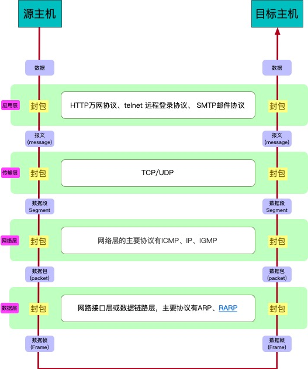

# TCP/IP 协议

## 简介

TCP/IP 协议是目前使用最为广泛的网络传输协议, 即传输控制/网络协议，也叫作网络通讯协议。它是在网络的使用中的最基本的通信协议

TCP/IP 协议并不是由 命名的 TCP 和 IP 协议组成,而是一整个网络传输控制,网络寻址,物理传输的一系列的协议簇,是由一整套的完整解决方案的协议组成的.

TCP/IP传输协议对互联网中各部分进行通信的标准和方法进行了规定。并且，TCP/IP传输协议是保证网络数据信息及时、完整传输的两个重要的协议。TCP/IP传输协议是严格来说是一个四层的体系结构，应用层、传输层、网络层和数据链路层都包含其中。

在网络通信过程中,协议实际上是一种封包的标准,源主机按照协议从上到下将我们需要传输的数据通过打包并打包上对应的标签信息,也就是我们的头信息.然后目标主机接收到数据之后从协议自下而上解封包的过程,最后拿到传输的数据流.这就类似于一个物理平台,我们的协议就是包装过程.

**TCP/IP协议能够迅速发展起来并成为事实上的标准，是它恰好适应了世界范围内数据通信的需要。它有以下特点：**

- 协议标准是完全开放的，可以供用户免费使用，并且独立于特定的计算机硬件与操作系统。
- 独立于网络硬件系统，可以运行在广域网，更适合于互联网。
- 网络地址统一分配，网络中每一设备和终端都具有一个唯一地址。
- 高层协议标准化，可以提供多种多样可靠网络服务。

## 体系结构
TCP/IP 协议由一个四层的体系结构构成,分别是:

- 应用层
- 传输层
- 网络层
- 数据层

### 网络通信过程
在网络通信的过程中，将发出数据的主机称为源主机，接收数据的主机称为目的主机。当源主机发出数据时，数据在源主机中从上层向下层传送。源主机中的应用进程先将数据交给应用层，应用层加上必要的控制信息就成了报文流，向下传给传输层。传输层将收到的数据单元加上本层的控制信息，形成报文段、数据报，再交给网际层。网际层加上本层的控制信息，形成IP数据报，传给网络接口层。网络接口层将网际层交下来的IP数据报组装成帧，并以比特流的形式传给网络硬件（即物理层），数据就离开源主机。

以下是从源主机到目标主机的通信过程.

### 数据层
在TCP/IP协议中，网络接口层位于第四层。由于数据层兼并了物理层和数据链路层所以，数据层既是传输数据的物理媒介，也可以为网络层提供一条准确无误的线路。

以太网协议规定，接入网络的设备都必须安装网络适配器，即网卡，数据包必须是从一块网卡传送到另一块网卡。而网卡地址就是数据包的发送地址和接收地址，有了MAC地址以后，以太网采用广播形式，把数据包发给该子网内所有主机，子网内每台主机在接收到这个包以后，都会读取首部里的目标MAC地址，然后和自己的MAC地址进行对比，如果相同就做下一步处理，如果不同，就丢弃这个包。
所以链路层的主要工作就是对电信号进行分组并形成具有特定意义的数据帧，然后以广播的形式通过物理介质发送给接收方。

### 网络层
网络层在TCP/IP协议中的位于第三层。在TCP/IP协议中网络层可以进行网络连接的建立和终止以及IP地址的寻找等功能

#### IP协议
网络层引入了IP协议，制定了一套新地址，使得我们能够区分两台主机是否同属一个网络，这套地址就是网络地址，也就是所谓的IP地址。IP协议将这个32位的地址分为两部分，前面部分代表网络地址，后面部分表示该主机在局域网中的地址。如果两个IP地址在同一个子网内，则网络地址一定相同。为了判断IP地址中的网络地址，IP协议还引入了子网掩码，IP地址和子网掩码通过按位与运算后就可以得到网络地址。 
#### ARP协议
即地址解析协议，是根据IP地址获取MAC地址的一个网络层协议。其工作原理如下：ARP首先会发起一个请求数据包，数据包的首部包含了目标主机的IP地址，然后这个数据包会在链路层进行再次包装，生成以太网数据包，最终由以太网广播给子网内的所有主机，每一台主机都会接收到这个数据包，并取出标头里的IP地址，然后和自己的IP地址进行比较，如果相同就返回自己的MAC地址，如果不同就丢弃该数据包。ARP接收返回消息，以此确定目标机的MAC地址；与此同时，ARP还会将返回的MAC地址与对应的IP地址存入本机ARP缓存中并保留一定时间，下次请求时直接查询ARP缓存以节约资源。 
#### 路由协议
首先通过IP协议来判断两台主机是否在同一个子网中，如果在同一个子网，就通过ARP协议查询对应的MAC地址，然后以广播的形式向该子网内的主机发送数据包；如果不在同一个子网，以太网会将该数据包转发给本子网的网关进行路由。网关是互联网上子网与子网之间的桥梁，所以网关会进行多次转发，最终将该数据包转发到目标IP所在的子网中，然后再通过ARP获取目标机MAC，最终也是通过广播形式将数据包发送给接收方。而完成这个路由协议的物理设备就是路由器，路由器扮演着交通枢纽的角色，它会根据信道情况，选择并设定路由，以最佳路径来转发数据包。 

**所以，网络层的主要工作是定义网络地址、区分网段、子网内MAC寻址、对于不同子网的数据包进行路由。**

### 运输层
作为TCP/IP协议的第二层，运输层在整个TCP/IP协议中起到了中流砥柱的作用。且在运输层中，TCP和UDP也同样起到了中流砥柱的作用

上面数据层定义了主机的身份，即MAC地址，而网络层定义了IP地址，明确了主机所在的网段，有了这两个地址，数据包就从可以从一个主机发送到另一台主机。但实际上数据包是从一个主机的某个应用程序发出，然后由对方主机的应用程序接收。而每台电脑都有可能同时运行着很多个应用程序，所以当数据包被发送到主机上以后，是无法确定哪个应用程序要接收这个包。因此传输层引入了UDP协议来解决这个问题，为了给每个应用程序标识身份。

#### UDP协议
UDP协议定义了端口，同一个主机上的每个应用程序都需要指定唯一的端口号，并且规定网络中传输的数据包必须加上端口信息，当数据包到达主机以后，就可以根据端口号找到对应的应用程序了。UDP协议比较简单，实现容易，但它没有确认机制，数据包一旦发出，无法知道对方是否收到，因此可靠性较差，为了解决这个问题，提高网络可靠性，TCP协议就诞生了。
#### TCP协议

- [TCP协议详解](./tcp.md)

TCP即传输控制协议，是一种面向连接的、可靠的、基于字节流的通信协议。简单来说TCP就是有确认机制的UDP协议，每发出一个数据包都要求确认，如果有一个数据包丢失，就收不到确认，发送方就必须重发这个数据包。为了保证传输的可靠性，TCP协议在UDP基础之上建立了三次对话的确认机制，即在正式收发数据前，必须和对方建立可靠的连接。TCP数据包和UDP一样，都是由首部和数据两部分组成，唯一不同的是，TCP数据包没有长度限制，理论上可以无限长，但是为了保证网络的效率，通常TCP数据包的长度不会超过IP数据包的长度，以确保单个TCP数据包不必再分割。 

**传输层的主要工作是定义端口，标识应用程序身份，实现端口到端口的通信，TCP协议可以保证数据传输的可靠性。**

### 应用层

应用层是TCP/IP协议的第一层，是直接为应用进程提供服务的。
- 对不同种类的应用程序它们会根据自己的需要来使用应用层的不同协议，邮件传输应用使用了SMTP协议、万维网应用使用了HTTP协议、远程登录服务应用使用了有TELNET协议。
- 应用层还能加密、解密、格式化数据。
- 应用层可以建立或解除与其他节点的联系，这样可以充分节省网络资源。

理论上有了上面三层协议,那么应用程序就能通过这一组协议来实现网络数据传输.目前基本上也都是使用 TCP 或则 UDP 协议传输数据.

而应用层协议这里只列举 HTTP 协议,这是前端开发最常用的协议. 

