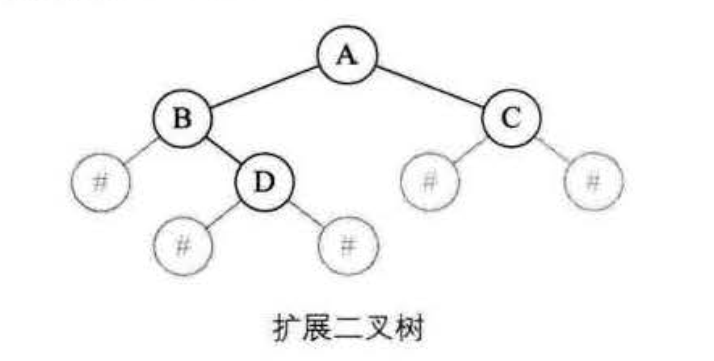

## 创建二叉树数据结构


#### 广义表（generalized lists）
使用来表示二叉树非常方便，假如我们有这么一个二叉树：


它可以表示为L = (A (B (C, D), E ( , F) ) )，直观地表达了树中各个节点之间的关系。

主要思路：

1. 逐个获取广义表字符串中除空格之外的每个字符，遇到左括号就标记START_LEFT_CHILD，遇到逗号就标记START_RIGHT_CHILD，遇到右括号就返回到父节点层次。当遇到字母时，就创建一个节点，并与父节点进行关联。

2. 遇到左括号时，下一步就要处理左子节点了，此时将当前新创建的节点入栈作为栈顶元素（第一次为空），它是下一个新创建节点的父节点。
3. 遇到字母A时，创建一个节点对象作为根节点；之后再遇到字母时，如果当前标记为START_LEFT_CHILD，就作为父节点的左子节点，如果当前标记为START_RIGHT_CHILD，那就作为父节点的右子节点。
4. 遇到右括号时，返回父节点层次，此时相应元素出栈，栈顶指针退回一位。
5. 继续重复上几个步骤，最终返回根节点。


```javascript
//二叉树节点结构
function BinTreeNode (val) {
  this.val = val;
  this.left = null;
  this.right = null;
}

//通过广义表创建二叉树
function createBinTreeByGLists (gLists) {
  //根节点和当前节点
  var rootNode = null, currNode = null;

  //数组作为栈结构，top为栈顶指针，模拟入栈出栈
  var stack = [], top = -1;

  //flag标识当前要解析的类型
  var flag = 0;
  var START_LEFT_CHILD = 1, START_RIGHT_CHILD = 2;

  //字符串当前索引
  var index = 0;

  while (index < gLists.length) {
    //获取广义表字符串当前要解析的字符
    var c = gLists.charAt(index++);

    switch (c) {
      //遇到'('时，开始解析左子节点，栈顶指针递增一位，当前节点入栈作为新的父节点
      case '(':
        flag = START_LEFT_CHILD;
        stack[++top] = currNode;
        break;
      //遇到',' 开始解析右子节点
      case ',':
        flag = START_RIGHT_CHILD;
        break;
      //遇到')'时，栈顶指针递减一位，返回到父节点层次
      case ')':
        top--;
        break;
      //忽略空格
      case ' ':
        break;
      //处理节点
      default:
        //创建新节点
        currNode = new BinTreeNode(c);

        //第一个节点作为根节点
        if (rootNode === null) {
          rootNode = currNode;
        } else {
          //当前栈顶存放父节点，根据flag处理与父节点的关系
          switch (flag) {
            case START_LEFT_CHILD:
              stack[top].left = currNode;
              break;
            case START_RIGHT_CHILD:
              stack[top].right = currNode;
              break;
          }
        }
    }
  }

  //返回树的根节点
  return rootNode;
}
```

#### 完全二叉树模型

完全二叉树的模型空数据的地方用#表示，如下图所示我们称之为扩展二叉树，我们取其前序遍历的序列 AB#D##C##

<div align="center">
   
</div>

```javascript
//前序遍历得到的字符串

function createBitree (string) {
  let strArr = string.split('');

  function BiNode (val) {
    this.val = val;
    this.left = null;
    this.right = null;
  }

  var newTree = new BiNode('#');

// 前序递归创建,可调整中序后序
  function createNode (biTree) {
    if (strArr.length == 0) return;
    let str = strArr.shift();
    if (str == '#') return;
    biTree.val = str;
    if (strArr[0] != '#') {
      biTree.left = new BiNode('#')
    }
    
    createNode(biTree.left);
    if (strArr[0] != '#') {
      biTree.right = new BiNode('#')
    }
    createNode(biTree.right);
  }
  createNode(newTree)
  return newTree
}

createBitree('AB#D##C#')
```


## 二叉树遍历方法

#### 前序遍历

先遍历根结点，然后左子树，再右子树

```javascript
function preTraverse(biTree) {
  if (biTree == null) return;
  console.log(biTree.data);
  preTraverse(biTree.lChild);
  preTraverse(biTree.rChild);
}
```


#### 中序遍历

先遍历左子树，然后根结点，再右子树
```javascript
function centerTraverse(biTree) {
  if (biTree == null) return;
  centerTraverse(biTree.lChild);
  console.log(biTree.data);
  centerTraverse(biTree.rChild);
}
```

#### 后序遍历

先遍历左子树，然后右子树，再根结点
```javascript
function lastTraverse(biTree) {
  if (biTree == null) return;
  lastTraverse(biTree.lChild);
  lastTraverse(biTree.rChild);
  console.log(biTree.data);
}
```

#### 层次遍历

按照二叉树层级遍历

```javascript
/**
 * Definition for a binary tree node.
 * function TreeNode(val) {
 *     this.val = val;
 *     this.left = this.right = null;
 * }
 */
/**
 * @param {TreeNode} root
 * @return {number[][]}
 */
var levelOrderBottom = function (root) {

    /**
     * 栈方法
     */

    // const stack = [{ index: 0, node: root }]
    // const res = []

    // while (stack.length > 0) {
    //     const { index, node } = stack.pop()

    //     if (!node) continue;

    //     res[index]
    //         ? (res[index].push(node.val))
    //         : (res[index] = [node.val])

    //     node.right && stack.push({ index: index + 1, node: node.right })
    //     node.left && stack.push({ index: index + 1, node: node.left })
    // }

    // return res.reverse()

    /**
     * 队列方法
     */

    const queue = [root]
    let index = 0
    const res = []
    while (queue.length > 0) {
        const len = queue.length
        for (let i = 0; i < len; i++) {
            const node = queue.shift()
            if (!node) continue
            res[index]
                ? (res[index].push(node.val))
                : (res[index] = [node.val])

            node.left && queue.push(node.left)
            node.right && queue.push(node.right)
        }
        index++
    }
    return res.reverse()
};
```


## 判断镜像对称二叉树

```javascript

// 方法一 递归
const isSymmetric = (root) => {
  
  const check = (left, right) => {
    if (left == null && right == null) { // 两个子树都为null，是对称的
      return true;
    }
    if (left && right) {  // 两个子树都存在，则需要：root值相同，且他们的子树也满足镜像
      return left.val == right.val && check(left.left, right.right) && check(left.right, right.left);
    }
    return false;         // 一个子树存在一个不存在，肯定不对称
  };

  if (root == null) {     // 如果传入的root就是null，对称
    return true;
  }           
  return check(root.left, root.right); // 否则，判断它的左右子树是否满足对称
};

// 方法二 BFS 层次
const isSymmetric = (root) => {
  var q = [root, root], n, m
  while (q.length) {
      n = q.shift(), m = q.shift()
      if (!m && !n) continue
      if (!m || !n || m.val !== n.val) return false
      q.push(n.left, m.right, n.right, m.left)
  }
  return true
}

```