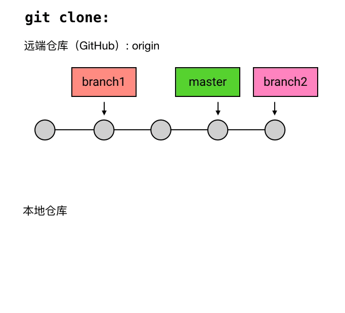
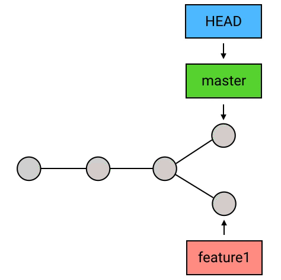
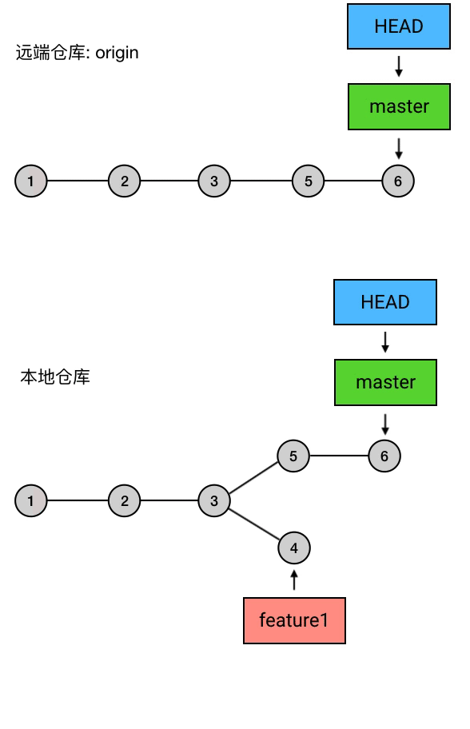

::: tip 本文引用参考文档地址
- [runoob shell 教程](https://www.runoob.com/linux/linux-shell.html)
:::


# GIT 

本手册主要以操作命令的说明为主，力求包含大部分常用命令，适合初级使用者阅读。由于GIT本身命令繁多、过于灵活的原因，很多使用者对一些命令容易混肴，所以本文在讲解命令时，加入一些底层原理的说明，以使读者能清晰概念、熟练使用。

## 一、Git配置

### 1.1 查看配置

1. 查看现在的git环境详细配置

```shell
git config -l 
```

2. 查看不同级别的配置文件

```shell
#查看系统config
git config --system --list
　　
#查看当前用户（global）配置
git config --global  --list
 
#查看当前仓库配置信息
git config --local  --list
```

3. 配置文件位置

   * `--system` 系统级：(windows) <GIT安装目录>`\Git\mingw64\etc\gitconfig`，`（linux) /etc/gitconfig`

   * `--global` 用户级：(windows) <用户目录>\\`.gitconfig`，（`linux）~/.gitconfig`

   * `--local` 仓库级：<项目目录>\\.`git\config`

注意：对于同一配置项，三个配置文件的优先级是`system < global < local`

### 1.2 设置用户名与邮箱

> 设置用户名称和 `e-mail` 地址是第一步，每次 `Git` 提交都会使用该信息，它被永远的嵌入到了提交中。

```shell
git config --global user.name "XXX"  #名称
git config --global user.email XXX@XXX.com   #邮箱
```

注意：`--global`为全局配置，不加为某个项目的特定配置。


## 二、获得GIT仓库

### 2.1 创建本地仓库

> 创建全新仓库，在项目的根目录执行指令，会在项目目录产生`.git`目录

```shell
# 在当前目录新建一个Git代码库
git init
```

创建和使用本地库完整示例

```shell
#1、创建目录
mkdir project7

#2、进入目录
cd project7

#3、初始化目录为git项目
git init

#4、创建md文件追加内容# project7(一级标题)
echo "# project7" >> README.md

#5、添加说明文件到暂存区
git add README.md

#6、提交到本地仓库并写日志
git commit -m "first commit"

#7、添加远程主机，主机名为origin 地址为https://git.xxx.com/xxx.git
git remote add origin https://git.xxx.com/xxx.git

#8、本地的master分支推送到origin主机，同时指定origin为默认主机，后面就可以不加任何参数使用git push了，-u 参数指定一个默认主机
git push -u origin master
```


### 2.2 克隆远程仓库

> 将远程服务器上的仓库完全镜像一份至本地

```shell
# 克隆一个项目和它的整个代码历史(版本信息)
git clone [url]
```

**原理：**



## 三、GIT文件操作

### 3.1 查看文件状态

```shell
#查看指定文件状态
git status [filename]

#查看所有文件状态
git status
```

### 3.2 将未跟踪的文件添加到暂存区

```shell
# 添加指定文件到暂存区
git add [file1] [file2] ...

# 添加指定目录到暂存区，包括子目录
git add [dir]

# 添加当前目录的所有文件到暂存区
git add .
```

### 3.3 提交

---

#### 3.3.1 提交暂存

> 通过add只是将文件或目录添加到了暂存区，使用commit可以实现将暂存区的文件提交到本地仓库。

```shell
# 提交暂存区到仓库区
git commit -m [message]

# 提交暂存区的指定文件到仓库区
git commit [file1] [file2] ... -m [message]

# 提交工作区自上次commit之后的变化，直接到仓库区，跳过了add,对新文件无效
git commit -a

# 提交时显示所有diff信息
git commit -v

# 使用一次新的commit，替代上一次提交
# 如果代码没有任何新变化，则用来改写上一次commit的提交信息
git commit --amend -m [message]

# 重做上一次commit，并包括指定文件的新变化
git commit --amend [file1] [file2] ...
```

**原理：**


#### 3.3.2 修订提交

```shell
#修订提交
git commit --amend
```

**原理：**


#### 3.3.3 撤销提交

> 撤销提交有两种方式：使用`HEAD`指针和使用`commit id`
> 在`Git`中，有一个HEAD指针指向当前分支中最新的提交。当前版本，我们使用`HEAD^`，那么再钱一个版本可以使用`HEAD^^`，如果想回退到更早的提交，可以使用`HEAD~n`。（也就是，`HEAD^=HEAD~1`，`HEAD^^=HEAD~2`）

```shell
# 撤销上一次的提交,原理就是放弃工作区和暂存区的改动，同时HEAD指针指向前一个commit对象
git reset --hard HEAD~1
git reset --hard HEAD^
git reset --hard 59cf933
```

**原理：**


**注：**`git reset –-soft`和`git reset --hard`的区别在于：`–-soft`回退到某个版本，只回退了`commit`的信息，不会恢复到index file一级。如果还要提交，直接`commit`即可；`-–hard`彻底回退到某个版本，本地的源码也会变为上一个版本的内容，撤销的`commit`中所包含的更改被冲掉。

```shell
# 增加一条新的 `commit`，它的内容和倒数第二个 `commit` 是相反的，从而和倒数第二个 `commit` 相互抵消，达到撤销的效果。
git revert HEAD^
```

### 3.4 日志与历史

```shell
# 查看提交日志
git log

# 以图形化的方式显示提交历史的关系
git log --graph

# 显示1行
git log -1

# 一个提交一行显示
git log --oneline

# 显示所有更新记录，包括已经撤销的更新
git reflog

# 显示commit历史，以及每次commit发生变更的文件
git log --stat

# 显示指定文件相关的每一次diff
git log -p [file]

# 显示某次提交的元数据和内容变化
git show [commit]

# 显示某次提交发生变化的文件
git show --name-only [commit]

# 显示某次提交时，某个文件的内容
git show [commit]:[filename]

# 显示指定文件是什么人在什么时间修改过
git blame [file]
```


### 3.5 撤销修改

1. 取消暂存（撤销add）

```shell
# 暂存区的目录树会被重写，被当前分支指向的目录树所替换，但是工作区不受影响。
git reset HEAD <file>
```

2. 撤销工作区文件修改


```shell
# 用暂存区指定的文件替换工作区的文件。
git checkout -- <file>
```

3. 撤销工作区修改和暂存的内容

```shell
# 用HEAD 指向的分支中的文件替换暂存区和以及工作区中的文件
git checkout HEAD <file>
```


### 3.6 删除文件

---

#### 3.6.1 删除未跟踪文件

> 如果文件还是未跟踪状态，直接删除文件就可了，bash中使用rm可以删除文件。

#### 3.6.2 删除暂存文件

```shell
# 从暂存区删除文件，工作区物理文件则不做出改变
git rm --cached <file>

# 不但从暂存区中删除，同时删除工作区物理文件
git rm <file>
```


### 3.7 查看文件修改后的差异

> 用`git status`只能查看对哪些文件做了改动，如果要看改动了什么，可以用：

```shell
# 查看文件修改后的差异
git diff <file>

# 比较暂存区的文件与之前本地仓库中已经提交过的文件差异
git diff --cached <file>

# 比较本地仓库中已经提交过的文件与工作空间中的文件差异
git diff HEAD <file>

# 显示分支之间的差异
git diff [first-branch]...[second-branch]
```

### 3.8 签出

```shell
# 检出branch分支。更新HEAD以指向branch分支，以及用branch指向的树更新暂存区和工作区。
git checkout branch

# 汇总显示工作区、暂存区与HEAD的差异。
git checkout

# 同上
git checkout HEAD

# 用暂存区中filename文件来覆盖工作区中的filename文件。相当于取消自上次执行git add filename以来（如果执行过）的本地修改。
git checkout -- filename

# 维持HEAD的指向不变。用branch所指向的提交中filename替换暂存区和工作区中相应的文件。注意会将暂存区和工作区中的filename文件直接覆盖。
git checkout branch -- filename

# 注意git checkout 命令后的参数为一个点（“.”）。这条命令最危险！会取消所有本地的  #修改（相对于暂存区）。相当于用暂存区的所有文件直接覆盖本地文件，不给用户任何确认的机会！
git checkout -- . 或写作 git checkout .

# 如果不加commit_id，那么git checkout -- file_name 表示恢复文件到本地版本库中最新的状态。
git checkout commit_id -- file_name
```

### 3.9 忽略文件

> * 当不想把某些文件纳入版本控制中，在主目录下建立`.gitignore`文件。
> * 该文件只能作用于 Untracked Files，也就是那些从来没有被 Git 记录过的文件（自添加以后，从未 add 及 commit 过的文件）。
> *  如果文件曾经被 Git 记录过，那么 `.gitignore` 就对它们完全无效。

### 3.10 临时保存

将目前还不想提交的但是已经修改的内容进行保存至堆栈中，包括工作区和暂存区中的内容，后续可以在某个分支上恢复出堆栈中的内容。

```shell
# 将所有未提交的修改（工作区和暂存区）保存至堆栈中，用于后续恢复当前工作目录。
git stash

# 查看当前stash中的内容。
git stash list

# 查看堆栈中最新保存的stash和当前目录的差异。
git stash show

# 将当前stash中的内容弹出，并应用到当前分支对应的工作目录上。堆栈中的内容会删除。
git stash pop

# 将堆栈中的内容应用到当前目录，不同于git stash pop，该命令不会将内容从堆栈中删除。
git stash apply

# 从堆栈中移除某个指定的stash
git stash drop + 名称

# 清除堆栈中的所有内容。
git stash clear
```

### 3.11 合并提交点

获取某一个分支的某一次提交，并作为一个新的提交引入到当前分支上。

```shell
git cherry-pick <commit-id>

# 中止cherry-pick
git cherry-pick --abort
```


## 四、GIT分支

### 4.1 新建分支

```shell
# 新建一个分支，但依然停留在当前分支
git branch [branch-name]

# 新建一个分支，并切换到该分支
git checkout -b [branch]

# 新建一个分支，指向指定commit
git branch [branch] [commit]

# 新建一个分支，与指定的远程分支建立追踪关系
git branch --track [branch] [remote-branch]
```

**原理：**


### 4.2 查看分支

```shell
# 列出所有本地分支
git branch

# 列出所有远程分支
git branch -r

# 列出所有本地分支和远程分支
git branch -a

# 查看本地分支和远程分支的映射关系
git branch -vv
```

### 4.3 切换分支

```shell
# 切换到指定分支，并更新工作区
git checkout [branch-name]

# 切换到上一个分支
git checkout -
```

**原理：**

1. 切换到feature1分支。


2. 在feature1上提交一次。


### 4.4 合并分支

```shell
# 合并指定分支到当前分支
git merge [branch]

# 合并指定分支到当前分支
git merge [branch]

# 取消合并
git merge --abort
```

**合并原理：**

从目标 `commit` 和当前 `commit` （即 `HEAD` 所指向的 `commit`）分叉的位置起，把目标 `commit` 的路径上的所有 `commit` 的内容一并应用到当前 `commit`，然后自动生成一个新的 `commit`。

例如下面这个图中：


`HEAD` 指向了 `master`，所以如果这时执行：

```shell
git merge branch1
```

Git 会把 `5` 和 `6` 这两个 `commit` 的内容一并应用到 `4` 上，然后生成一个新的提交，并跳转到提交信息填写的界面：


`merge` 操作会帮你自动地填写简要的提交信息。在提交信息修改完成后（或者你打算不修改默认的提交信息），就可以退出这个界面，然后这次 `merge` 就算完成了。


### 4.5 删除分支

```shell
# 删除分支
git branch -d [branch-name]

# 强制删除分支
git branch -D [branch-name]

# 删除远程分支
git push origin --delete [branch-name]
git branch -dr [remote/branch]
```

**原理：**



### 4.6 建立追踪关系

```shell
# 建立追踪关系，在现有分支与指定的远程分支之间
git branch --set-upstream [branch] [remote-branch]

git push --set-upstream [origin] [remote-branch]
git push -u [origin] [remote-branch]
```


## 五、远程仓库

### 5.1 远程仓库url类型

---

- **https 类型**

`https://xxx.com/xxx/xxxx.git`

使用加密的网页访问通道读写仓库，使用用户名及密码进行鉴权。 

- **SSH类型**

`git@xxx.com/xxx/xxxx.git`

使用加密通道读写仓库，无单次上传限制，需先设置 “账户 SSH 公钥”，完成配对验证。

- **Git配置SSH key**

1. 生成秘钥

```shell
# 会在<用户目录>\.ssh目录下生成id_rsa和id_rsa.pub两个文件
ssh-keygen -t rsa -C "你的邮箱地址"
```

2. 配置公钥

将id_rsa.pub里的内容拷贝到git网站里的`添加公钥`中。

3. 验证

```shell
# 以码云为例，验证设置是否可以连接
ssh -T git@gitee.com
```

### 5.2 常用操作指令

---

```shell
# 显示所有远程仓库
git remote -v

# 显示某个远程仓库的信息
git remote show [remote]

# 增加一个新的远程仓库，并命名
git remote add [shortname] [url]

# 取回远程仓库的变化，并与本地分支合并
git pull [remote] [branch]

# 上传本地指定分支到远程仓库
git push [remote] [branch]

# 强行推送当前分支到远程仓库，即使有冲突
git push [remote] --force

# 推送所有分支到远程仓库
git push [remote] --all

# 简单查看远程---所有仓库
git remote  （只能查看远程仓库的名字）

# 查看单个仓库
git  remote show [remote-branch-name]

# 新建远程仓库
git remote add [branchname]  [url]

# 修改远程仓库
git remote rename [oldname] [newname]

# 删除远程仓库
git remote rm [remote-name]

# 获取远程仓库数据
git fetch [remote-name] (获取仓库所有更新，但不自动合并当前分支)
git pull (获取仓库所有更新，并自动合并到当前分支)

# 上传数据，如git push origin master
git push [remote-name] [branch]
```

#### **5.2.1 git remote**

> 为了便于管理，Git要求每个远程主机都必须指定一个主机名。`git remote`命令就用于管理主机名。默认主机名为origin。

```shell
# 不带选项的时候，git remote命令列出所有远程主机。
git remote

# 使用-v选项，可以参看远程主机的网址。
git remote -v

# 查看该主机的详细信息。
git remote show <主机名>

# 添加远程主机。
git remote add <主机名> <网址>

# 删除远程主机。
git remote rm <主机名>

# 远程主机改名
git remote rename <原主机名> <新主机名>

# 修改远程主机地址
get remote set-url [主机名] [地址]

# 查看主机网址
git remote get-url [主机名]
```

#### **5.2.2 git fetch**

> 一旦远程主机的版本库有了更新（Git术语叫做commit），需要将这些更新取回本地，这时就要用到`git fetch`命令。

```shell
# 将远程主机的更新，全部取回本地
git fetch <远程主机名>

# 取回特定分支的更新
git fetch <远程主机名> <分支名>
```

**示例：**

1. 取回`origin`主机的`master`分支。

```shell
git fetch origin master
```

所取回的更新，在本地主机上要用"远程主机名/分支名"的形式读取。比如`origin`主机的`master`，就要用`origin/master`读取。

2. 查看分支情况

```shell
git branch -r
origin/master

git branch -a
* master
  remotes/origin/master
```

上面命令表示，本地主机的当前分支是`master`，远程分支是`origin/master`。

3. 取回远程主机的更新以后，可以在它的基础上，使用`git checkout`命令创建一个新的分支。

```shell
# 在origin/master的基础上，创建一个新分支
git checkout -b newBrach origin/master
```

4. 本地分支上合并远程分支

```shell
# 在当前分支上，合并origin/master
git merge origin/master

# 在当前分支上，合并origin/master(变基)
git rebase origin/master
```

#### **5.2.3 git pull**

> 取回远程主机某个分支的更新，再与本地的指定分支合并。

```shell
# 合并需要采用merge模式
git pull <远程主机名> <远程分支名>:<本地分支名>

# 合并需要采用rebase模式
git pull --rebase <远程主机名> <远程分支名>:<本地分支名>
```

**注**：如果远程主机删除了某个分支，默认情况下，`git pull` 不会在拉取远程分支的时候，删除对应的本地分支。这是为了防止，由于其他人操作了远程主机，导致`git pull`不知不觉删除了本地分支。

示例：**

1. 取回`origin`主机的`next`分支，与本地的`master`分支合并，需要写成下面这样。

```shell
git pull origin next:master
```

2. 如果远程分支是与当前分支合并，则冒号后面的部分可以省略

```shell
# 取回origin/next分支，再与当前分支合并
git pull origin next

# 等同于先做git fetch，再做git merge
git fetch origin
git merge origin/next
```

**注**：在某些场合，Git会自动在本地分支与远程分支之间，建立一种追踪关系（tracking）。比如，在`git clone`的时候，所有本地分支默认与远程主机的同名分支，建立追踪关系，也就是说，本地的`master`分支自动"追踪"`origin/master`分支。

3. 手动建立追踪关系使用：

```shell
git branch --set-upstream master origin/next
```

4. 如果当前分支与远程分支存在追踪关系，`git pull`就可以省略远程分支名。

```shell
# 本地的当前分支自动与对应的origin主机"追踪分支"（remote-tracking branch）进行合并
git pull origin
```

5. 如果当前分支只有一个追踪分支，连远程主机名都可以省略。

```shell
# 当前分支自动与唯一一个追踪分支进行合并
git pull
```

**原理：**


#### **5.2.4 git push**

 `git push`命令用于将本地分支的更新，推送到远程主机。它的格式与`git pull`命令相仿。

```shell
git push <远程主机名> <本地分支名>:<远程分支名>
```

**注意：**

* 分支推送顺序的写法是<来源地>:<目的地>，所以`git pull`是<远程分支>:<本地分支>，而`git push`是<本地分支>:<远程分支>。
* 如果省略远程分支名，则表示将本地分支推送与之存在"追踪关系"的远程分支（通常两者同名），如果该远程分支不存在，则会被新建。
* 在git的全局配置中，有一个push.default属性，其决定了git push操作的默认行为。push.default 有几个可选值：nothing, current, upstream, simple（默认）, matching
  *  nothing - push操作无效，除非显式指定远程分支，例如git push origin develop
  *  current - push当前分支到远程同名分支，如果远程同名分支不存在则自动创建同名分支。
  *  upstream - push当前分支到它的upstream分支上（这一项其实用于经常从本地分支push/pull到同一远程仓库的情景，这种模式叫做central workflow）。
  *  simple（默认） - simple和upstream是相似的，只有一点不同，simple必须保证本地分支和它的远程
     upstream分支同名，否则会拒绝push操作。只推送当前分支。
  *  matching - push所有本地和远程两端都存在的同名分支。推送所有有对应的远程分支的本地分支。

**示例：**

1. 将本地的`master`分支推送到`origin`主机的`master`分支。如果后者不存在，则会被新建。

```shell
git push origin master
```

2. 如果省略本地分支名，则表示删除指定的远程分支，因为这等同于推送一个空的本地分支到远程分支。

```shell
# 删除origin主机的master分支
git push origin :master
# 等同于
git push origin --delete master
```

3. 如果当前分支与远程分支之间存在追踪关系，则本地分支和远程分支都可以省略。

```shell
# 将当前分支推送到origin主机的对应分支
git push origin
```

3. 如果当前分支只有一个追踪分支，那么主机名都可以省略。

```shell
git push
```

4. 如果当前分支与多个主机存在追踪关系，则可以使用`-u`选项指定一个默认主机，这样后面就可以不加任何参数使用`git push`。

```shell
# 将本地的master分支推送到origin主机，同时指定origin为默认主机，后面就可以不加任何参数使用git push了。
git push -u origin master
```

5. 不管是否存在对应的远程分支，将本地的所有分支都推送到远程主机，这时需要使用`--all`选项。

```shell
# 将所有本地分支都推送到origin主机
git push --all origin
```

6. 如果远程主机的版本比本地版本更新，推送时Git会报错，要求先在本地做`git pull`合并差异，然后再推送到远程主机。这时，如果你一定要推送，可以使用`--force`选项。

```shell
git push --force origin 
```

**注：**使用`--force`选项，结果导致远程主机上更新的版本被覆盖。除非你很确定要这样做，否则应该尽量避免使用`--force`选项。

7. `git push`不会推送标签（tag），除非使用`--tags`选项。

```shell
git push origin --tags
```

**原理解析：把 branch 上传到远端仓库**

实质上，`push` 做的事是：把当前 `branch` 的位置（即它指向哪个 `commit`）上传到远端仓库，并把它的路径上的 `commit`s 一并上传。

例如，现在的本地仓库有一个 `master` ，它超前了远程仓库两个提交；另外还有一个新建的 `branch` 叫 `feature1`，远程仓库还没有记载过它。具体大概像这样：


这时我执行 `git push`，就会把 `master` 的最新位置更新到远端，并且把它的路径上的 `5` `6` 两个 `commit`s 上传：

```shell
git push
```


而如果这时候我再切到 `feature1` 去后再执行一次 `push`，就会把 `feature1` 以及它的 `commit` `4` 上传到远程仓库：

```shell
git checkout feature1
git push origin feature1
```





## 六、标签 tag


tag是git版本库的一个标记，指向某个commit的指针。

#### 6.1 新建标签

```shell
# 在当前 commit 上创建标签
git tag <tagname>

# 创建带注释的标签,弹出编辑器输入注释
git tag -a <tagname>

# 指定提交节点创建分支
git tag <tagname> <commit> 

# 创建指定注释的标签
git tag -a <tagname> -m '注释信息'
git tag -a -m '注释信息' <tagname>

# 创建带签名的标签
git tag -s <tagname>
git tag -u <keyid> <tagname>

# 强制打标签(不管命名冲突)
git tag <tagname> -f


```


#### 6.2 查看标签
```shell
# 查看所有标签
git tag

git tag -l

git tag -n

# 查看tag 指向commit 的修改信息
git show <tagname>
git show <commit>
```


#### 6.3 删除tag

```shell
# 删除本地tag
git tag -d <tagname>

# 删除远程tag
git push origin --delete tag <tagname>

# 删除本地和远程tag(通过推送空tag 到远程)
git tag -d <tagname>
git push origin :refs/tags/<tagname>
```

#### 6.4 远程tag

```shell
# 推送tag 到远程
git push --tags

# 推送指定的tag 到远程
git push origin <tagname> 

# 拉取远程tag
git fetch origin tag <tagname>

```