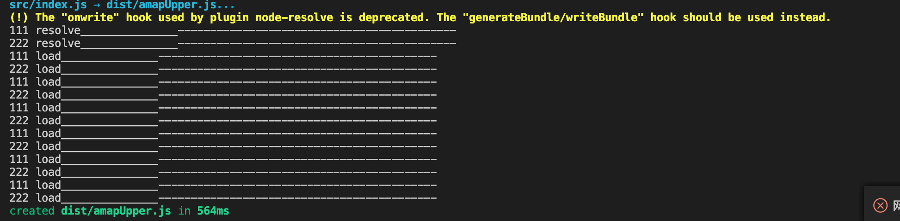
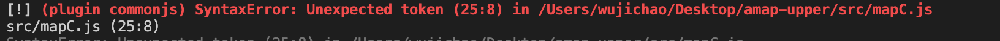

# 轻量化Library打包工具

## 简介

::: tip 本文引用参考文档地址
- [ Rollup 官方中文文档 ](https://www.rollupjs.com/)
- [ rollup 搭建打包 JS ](https://juejin.im/post/6844903896830181383#heading-7)
- [ rollup打包js的注意点 ](https://juejin.im/post/6844903713165803527)
- [ babel 7 的使用的个人理解 ](https://www.jianshu.com/p/cbd48919a0cc)
:::


Rollup 是一个 JavaScript 模块打包器，可以将小块代码编译成大块复杂的代码，例如 library 或应用程序。

Rollup 对代码模块使用新的标准化格式，这些标准都包含在 JavaScript 的 ES6 版本中，而不是以前的特殊解决方案，如 CommonJS 和 AMD。ES6 模块可以使你自由、无缝地使用你最喜爱的 library 中那些最有用独立函数，而你的项目不必携带其他未使用的代码。ES6 模块最终还是要由浏览器原生实现，但当前 Rollup 可以使你提前体验。

###  Why is rollup

`Rollup` 着眼于未来，采用原生的`ES` 标准的模块机制进行构建，未来`ES` 规范肯定会由浏览器实现，也是JavaScript语言明确的发展方向。机制更加优于`CommonJS`

`CommonJS` 是在`ES`规范之前被提出的一种暂时性性解决方案，是一种特殊的传统格式，

相比较`ES`模块允许进行静态分析，从而实现像 tree-shaking 的优化，并提供诸如循环引用和动态绑定等高级功能

`Tree-shaking`, 也被称为 "live code inclusion," 它是清除实际上并没有在给定项目中使用的代码的过程，但是它可以更加高效。

###  构建工具对比

| 打包工具       | 体积           | 注入代码  | code spliting     | dynamic import     | Tree-shaking    |
| ------------- |:-------------:| ------:  | -----------------:| -----------------: | ---------------: |
| webpack       | large         | more     |:white_check_mark: |:white_check_mark:  | :x:              |
| rollup        | small         | less     |:x:                |:x:                 | :white_check_mark:|


webpack 是一款强大的 `bundle` 构建工具，通过 `loader`机制可以处理各种类型的文件，良好的 `code splitting`和`dynamic import`支持使得`webpack` 成为了应用程序，单页应用的全能型的的打包工具。

但是因为其打包体积相对较大，注入代码更多，没有良好的`Tree-shaking`所以在`Library` 的打包工作中，不如`rollup`打包的精简。


## 配置

`rollup` 定位是一款轻量级的构建工具，其配置也相对很简单，但是由于不支持`CommonJs`，在配置`rollup-plugin-commonjs` 将`CommmonJS` 转化成`ES` 模块方式的时候，需要配置`babel` 转译

由于`babel 7+`升级改动比较大，命名空间改动，市面上的教程大部分说的不够清楚，而且基本上停留在`babel 6`的配置，导致一直抛`(plugin commonjs) SyntaxError: Unexpected token`


在后文中会着力介绍这个部分，分析`babel 7+`配置以及各个`presets` 和`plugins` 的作用。


### 安装rollup
```
npm install --save-dev rollup
```

### 配置文件
在项目根目录创建`rollup.config.js`文件。


`rollup` 配置比较的简洁，一般包括`input`,`output`,`plugins`,`external`

[配置项参考](https://www.rollupjs.org/guide/en/#configuration-files)


这是一段简单的配置文件

```javascript
export default {
  input: 'src/index.js',
  output: {
    name: 'amapUpper',
    file: 'dist/amapUpper.js',
    format: 'umd' //兼容模式
  },
  external: ['@amap/amap-jsapi-loader'],// 配置引入的包是否要打包，在这里配置的会忽略掉，不打包到我们的程序里面
  plugins: []
};
```

当你的配置文件需要配置多个打包策略的时候，你还可以这样配置

```javascript
export default [{
  input: 'main-a.js',
  output: {
    file: 'dist/bundle-a.js',
    format: 'cjs'
  }
}, {
  input: 'main-b.js',
  output: [
    {
      file: 'dist/bundle-b1.js',
      format: 'cjs'
    },
    {
      file: 'dist/bundle-b2.js',
      format: 'es'
    }
  ]
}]
```


你还可以使用多个配置文件，使用`--config`来使用配置文件

```
# pass a custom config file location to Rollup
rollup --config my.config.js
```

::: danger
使用了`umd`模式必须指定` Name for UMD export`
:::


### 配置rollup插件
配置gollup 的plugin 类似babel 全部移植到了`@rollup`下,在官方提供的  一站式配置商店，可以下载所需的插件,
作用在于可维护学习被误导成本降低，更有利于长期维护。

[@plugin 链接地址](https://github.com/rollup/plugins)


#### 插件是什么

`rollup plugin` 是一个遵循`rollup`插件规范的`object`，一般通过一个工厂函数返回一个对象实现


一段简单的示例：
```javascript
export default function myExample () {
  return {
    name: 'my-example', // this name will show up in warnings and errors
    resolveId ( source ) {
      if (source === 'virtual-module') {
        return source; // this signals that rollup should not ask other plugins or check the file system to find this id
      }
      return null; // other ids should be handled as usually
    },
    load ( id ) {
      if (id === 'virtual-module') {
        return 'export default "This is virtual!"'; // the source code for "virtual-module"
      }
      return null; // other ids should be handled as usually
    }
  };
}
```

然后在配置文件中引用该插件，在plugins中，传入执行返回的对象

```sh
import myExample from 'myExample'


plugins: [ myExample() ]
```


#### 插件对象遵循的规范

A Rollup plugin is an object with one or more of the `properties`, `build hooks`, and `output generation hooks`
  - [properties](https://www.rollupjs.org/guide/en/#properties)
  - [build hooks 构建钩子](https://www.rollupjs.org/guide/en/#build-hooks)
  - [output generation hooks 输出钩子](https://www.rollupjs.org/guide/en/#output-generation-hooks)


#### 插件执行顺序
  
熟悉`webpack loader`机制的都应该知道`loader` 实际上是从右到左，自下而上执行的，在页头的[ rollup打包js的注意点 ](#简介)里面提到的错误记录/错误2里面，类比`webpack loader`机制，
其实是一个错误的类比，实际上`rollup`的`plugin` 机制是从左往右，自上而下而下的执行顺序。

一个测试例子

```javascript
// rollup.config.js
function myExample1() {
  return {
    name: 'my-example1', // this name will show up in warnings and errors
    resolveId(source) {
      console.log('111 resolve_______________-------------------------------------------');
      return null; // other ids should be handled as usually
    },
    load(id) {
      console.log('111 load_______________-------------------------------------------');
      return null; // other ids should be handled as usually
    }
  };
}
function myExample2() {
  return {
    name: 'my-example1', // this name will show up in warnings and errors
    resolveId(source) {
      console.log('222 resolve_______________-------------------------------------------');
      return null; // other ids should be handled as usually
    },
    load(id) {
      console.log('222 load_______________-------------------------------------------');
      return null; // other ids should be handled as usually
    }
  };
}


export default {
  input: 'src/index.js',
  output: {
    name: 'test',
    file: 'dist/test.js',
    format: 'umd'
  },
  plugins: [
    myExample1(),    
    myExample2()
  ]
};

```

<div align="center">
   
</div>


可以看到`load`,`resolve` 钩子函数都是从左往右，自上而下而下的执行顺序。


#### 配置常用的插件


下面介绍正常打包中需要用到的插件，和一般配置。

- `@rollup/plugin-json `    原`rollup-plugin-json`
- `@rollup/plugin-commonjs `    原`rollup-plugin-commonjs`
- `@rollup/plugin-node-resolve`     原`rollup-plugin-node-resolve`
- `rollup-plugin-terser`
 
首先，需要作为开发依赖安装这些插件
```
npm i @rollup/plugin-json -D
npm i @rollup/plugin-commonjs -D
npm i @rollup/plugin-node-resolve -D
npm i rollup-plugin-terser -D
```

然后需要引用配置文件

```javascript
import json from '@rollup/plugin-json';
import commonjs from '@rollup/plugin-commonjs';
import nodeResolve from '@rollup/plugin-node-resolve';
import babel from 'rollup-plugin-babel';
import { terser } from 'rollup-plugin-terser';

export default {
  ...
  plugins: [
    json(),
    terser(),
    nodeResolve(),
    commonjs(),
    babel({
      exclude: '*', // 排除node_modules 下的文件
      runtimeHelpers: true // 防止生成多个 打包helper 函数
    }),
  ]
};
```

## 问题总结

### commonjs 插件和 babel7+ 配置

在跟着[ rollup 搭建打包 JS ](#简介)一文配置的过程中，用到的插件不是官方一站式插件提供的长期维护版本，遇到了 `rollup-plugin-commonjs` 插件打包报错的问题


<div align="center">
   
</div>


针对使用了放弃维护的`rollup-plugin-commonjs`插件的打包抛出的这个`SyntaxError`,可以有两种解决方案。推荐方案二。

### 解决方案一 配置babel

查找了很多资料都显示，应该是`babel` 配置问题,主要分为：
- `babel` 配置问题
- `babel` 转译执行顺序问题


综合这些资料，这个报错应该是由于该commonjs 插件库 被移动到 `@rollup/plugin-commonjs`下维护，导致非长期维护版本缺少某些转译后的辅助函数，属性，导致抛出异常。

所以需要`babel` 辅助编译之后才能正确执行`commonjs` 插件。

**babel 配置的一些问题**

由于`babel 7+`版本中，将babel 的各个库全部移植到了`@babel/***`下统一官方维护，而市面上大部分的`babel`教程实际上没有对这点进行详细说明，而且教程里安装`babel`组件的时候并没有指定版本，实际上导致可能安装了**7+** 版本的`babel`核心库，而安装了放弃维护的`babel-plugins-***`下的插件预设之类的。就会导致一系列的问题。

这里要注意一下这个`@`这个符号，这个是只有`babel7`才特有的，`babel6`都木有，市面上大量代码都是基于6的所以要特别注意，安装的时候要使用
 `npm install i -S @babel\cli` 而不能是`npm install i -S babel-cli`了
这是 `babel 7` 的一大调整，原来的 `babel-xx` 包统一迁移到`babel`域 下 - 域由 `@` 符号来标识

::: tip 规划
接下来会顺着这篇文章出一篇总结`babel 7`配置问题的 文章，加油吧！奥利给！！！

目前可以参阅文章开头提到的 [ babel 7 的使用的个人理解 ](#简介)
:::


**配置**


由于这里使用`@rollup/plugin-babel`,执行`babel` 转译 所以不需要安装`@babel/cli`命令行工具。

首先我们需要安装：
- babel核心包`@babel/core`
- babel预设包`@babel/preset-env`
- 统一的模块化的helper`@babel/runtime`
- helper 的自动化引入工具 `@babel/plugin-transform-runtime`

```sh
npm i -D @babel/core
npm i -D @babel/preset-env
npm i -D @babel/runtime
npm i -D @babel/plugin-transform-runtime
```

然后在项目根目录下创建`.babelrc`的配置文件


```json
{
  "presets": [
    [
      "@babel/preset-env",
      {
        "modules": false,
        "targets": {
          "browsers": [
            "> 1%",
            "last 2 versions",
            "not ie <= 8"
          ]
        }
      }
    ]
  ],
  "plugins": ["@babel/plugin-transform-runtime"]
}
```

然后如果你用的是`rollup-plugin-commonjs`非常期维护版本的插件的话，由于和`babel`有依赖关系,你需要：

在`commonjs`插件之前引入`babel`插件，并配置需要匹配编译的文件，目录。和编译配置

```javascript
// rollup.config.js
export default {
  input: 'src/index.js',
  output: {
    name: 'amapUpper',
    file: 'dist/amapUpper.js',
    format: 'umd'
  },
  plugins: [
    babel({
      exclude: '/node_modules/**', // 排除node_modules 下的文件
      runtimeHelpers: true // 与plugin-transform-runtime 插件对应配置，生成统一化helper。
    }),
    commonjs()
  ]
};
```


### 解决方案二

使用`rollup`新的官方提供的移动后的一站式插件库里面的插件

[rollup @plugin 链接地址](https://github.com/rollup/plugins)

使用了新的插件库之后，`babel`还是需要配置的，只是解决了`commonjs` 插件依赖`babel`的问题。

而babel 实际上是解决各种浏览器，引擎之间的差异，而存在的。所以为了更好的支持，需要配备良好的babel配置。